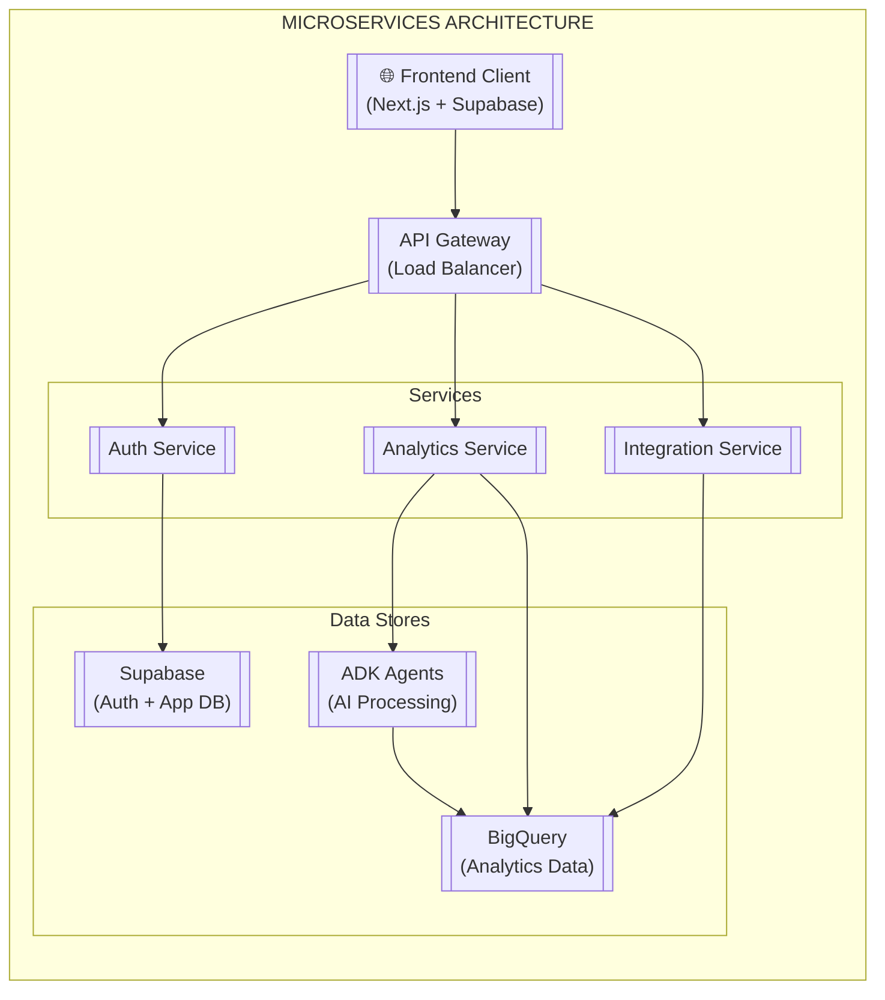

```mermaid
flowchart TB
    subgraph "MICROSERVICES ARCHITECTURE"
        direction TB
        
        CLIENT[["🌐 Frontend Client<br/>(Next.js + Supabase)"]]
        
        GATEWAY[["API Gateway<br/>(Load Balancer)"]]
        
        subgraph "Services"
            AS[["Auth Service"]]
            ANS[["Analytics Service"]]
            IS[["Integration Service"]]
        end
        
        subgraph "Data Stores"
            SUP[["Supabase<br/>(Auth + App DB)"]]
            BIG[["BigQuery<br/>(Analytics Data)"]]
            ADK[["ADK Agents<br/>(AI Processing)"]]
        end
        
        CLIENT --> GATEWAY
        GATEWAY --> AS
        GATEWAY --> ANS
        GATEWAY --> IS
        AS --> SUP
        ANS --> ADK
        ANS --> BIG
        IS --> BIG
        ADK --> BIG
    end
```