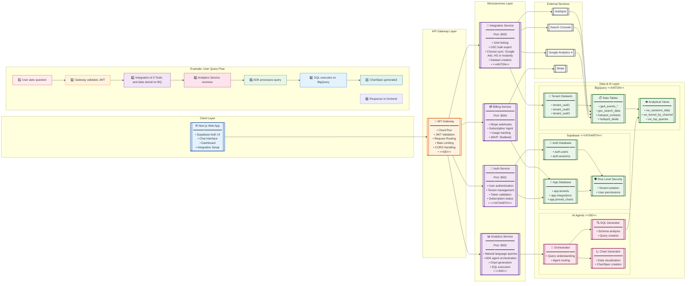

```mermaid

flowchart LR
    subgraph "Client Layer"
        WEB[["🌐 Next.js Web App<br/>━━━━━━━━━━━━━━━━<br/>• Supabase Auth UI<br/>• Chat Interface<br/>• Dashboard<br/>• Integration Setup"]]
    end
    
    subgraph "API Gateway Layer"
        GATEWAY[["🚪 API Gateway<br/>━━━━━━━━━━━━━━━━<br/>• Cloud Run<br/>• JWT Validation<br/>• Request Routing<br/>• Rate Limiting<br/>• CORS Handling<br/>• >>SID<<"]]
    end
    
    subgraph "Microservices Layer"
        direction TB
        
        AUTH_SERVICE[["🔑 Auth Service<br/>━━━━━━━━━━━━━━━━<br/>Port: 8001<br/>━━━━━━━━━━━━━━━━<br/>• User authentication<br/>• Tenant management<br/>• Token validation<br/>• Subscription status<br/>• >>YATHARTH<<"]]
        
        ANALYTICS_SERVICE[["📊 Analytics Service<br/>━━━━━━━━━━━━━━━━<br/>Port: 8002<br/>━━━━━━━━━━━━━━━━<br/>• Natural language queries<br/>• ADK agent orchestration<br/>• Chart generation<br/>• SQL execution<br/>• >>SID<<"]]
        INTEGRATION_SERVICE[["🔌 Integration Service<br/>━━━━━━━━━━━━━━━━<br/>Port: 8003<br/>━━━━━━━━━━━━━━━━<br/>• GA4 linking<br/>• GSC bulk export<br/>• Choose sync: Google Ads, HS or Instantly<br/>• Dataset creation<br/>• >>ANTON<<"]]
        
        
        BILLING_SERVICE[["💳 Billing Service<br/>━━━━━━━━━━━━━━━━<br/>Port: 8004<br/>━━━━━━━━━━━━━━━━<br/>• Stripe webhooks<br/>• Subscription mgmt<br/>• Usage tracking<br/>• (MVP: Stubbed)"]]
    end
    
    subgraph "Data & AI Layer"
        direction LR
        
        subgraph "Supabase >>YATHARTH<<"
            SUPABASE_AUTH[["🔐 Auth Database<br/>━━━━━━━━━━━━━━━━<br/>• auth.users<br/>• auth.sessions"]]
            
            SUPABASE_APP[["💾 App Database<br/>━━━━━━━━━━━━━━━━<br/>• app.tenants<br/>• app.integrations<br/>• app.pinned_charts"]]
            
            RLS[["🛡️ Row Level Security<br/>━━━━━━━━━━━━━━━━<br/>• Tenant isolation<br/>• User permissions"]]
        end
        
        subgraph "BigQuery >>ANTON<<"
            DATASETS[["📂 Tenant Datasets<br/>━━━━━━━━━━━━━━━━<br/>• tenant_uuid1<br/>• tenant_uuid2<br/>• tenant_uuid3"]]
            
            TABLES[["📋 Data Tables<br/>━━━━━━━━━━━━━━━━<br/>• ga4_events_*<br/>• gsc_search_data<br/>• hubspot_contacts<br/>• hubspot_deals"]]
            
            VIEWS[["👁️ Analytical Views<br/>━━━━━━━━━━━━━━━━<br/>• vw_sessions_daily<br/>• vw_funnel_by_channel<br/>• vw_top_queries"]]
        end
        
        subgraph "AI Agents >>SID<<"
            ADK_ORCH[["🤖 Orchestrator<br/>━━━━━━━━━━━━━━━━<br/>• Query understanding<br/>• Agent routing"]]
            
            ADK_SQL[["🔍 SQL Generator<br/>━━━━━━━━━━━━━━━━<br/>• Schema analysis<br/>• Query creation"]]
            
            ADK_CHART[["📈 Chart Generator<br/>━━━━━━━━━━━━━━━━<br/>• Data visualization<br/>• ChartSpec creation"]]
        end
    end
    
    subgraph "External Services"
        GA4[["Google Analytics 4"]]
        GSC[["Search Console"]]
        HUBSPOT[["HubSpot"]]
        STRIPE[["Stripe"]]
    end
    
    %% Connections
    WEB --> GATEWAY
    
    GATEWAY --> AUTH_SERVICE
    GATEWAY --> ANALYTICS_SERVICE
    GATEWAY --> INTEGRATION_SERVICE
    GATEWAY --> BILLING_SERVICE
    
    AUTH_SERVICE --> SUPABASE_AUTH
    AUTH_SERVICE --> SUPABASE_APP
    
    ANALYTICS_SERVICE --> ADK_ORCH
    ADK_ORCH --> ADK_SQL
    ADK_ORCH --> ADK_CHART
    ADK_SQL --> VIEWS
    
    INTEGRATION_SERVICE --> DATASETS
    INTEGRATION_SERVICE --> GA4
    INTEGRATION_SERVICE --> GSC
    INTEGRATION_SERVICE --> HUBSPOT
    
    BILLING_SERVICE --> STRIPE
    BILLING_SERVICE --> SUPABASE_APP
    
    GA4 --> TABLES
    GSC --> TABLES
    HUBSPOT --> TABLES
    
    TABLES --> VIEWS
    DATASETS --> TABLES
    
    SUPABASE_APP --> RLS
    SUPABASE_AUTH --> RLS
    
    %% Styling
    classDef client fill:#e3f2fd,stroke:#0d47a1,stroke-width:2px
    classDef gateway fill:#fff3e0,stroke:#e65100,stroke-width:2px
    classDef service fill:#f3e5f5,stroke:#4a148c,stroke-width:2px
    classDef data fill:#e8f5e9,stroke:#1b5e20,stroke-width:2px
    classDef ai fill:#fce4ec,stroke:#880e4f,stroke-width:2px
    classDef external fill:#f5f5f5,stroke:#424242,stroke-width:2px
    
    class WEB client
    class GATEWAY gateway
    class AUTH_SERVICE,ANALYTICS_SERVICE,INTEGRATION_SERVICE,BILLING_SERVICE service
    class SUPABASE_AUTH,SUPABASE_APP,RLS,DATASETS,TABLES,VIEWS data
    class ADK_ORCH,ADK_SQL,ADK_CHART ai
    class GA4,GSC,HUBSPOT,STRIPE external
    
    %% Request Flow Example
    subgraph "Example: User Query Flow"
        direction LR
        STEP1["1️⃣ User asks question"]
        STEP2["2️⃣ Gateway validates JWT"]
        STEP3["3️⃣ Integration of 3 Tools and data stored on BQ"]
        STEP4["4️⃣ Analytics Service receives"]
        STEP5["5️⃣ ADK processes query"]
        STEP6["6️⃣ SQL executes on BigQuery"]
        STEP7["7️⃣ ChartSpec generated"]
        STEP8["8️⃣ Response to frontend"]
    end
    
    STEP1 --> STEP2 --> STEP3 --> STEP4 --> STEP5 --> STEP6 --> STEP7
    
    style STEP1 fill:#ffebee,stroke:#c62828
    style STEP2 fill:#fff3e0,stroke:#ef6c00
    style STEP3 fill:#f3e5f5,stroke:#6a1b9a
    style STEP4 fill:#fce4ec,stroke:#ad1457
    style STEP5 fill:#e8f5e9,stroke:#2e7d32
    style STEP6 fill:#e3f2fd,stroke:#1565c0
    style STEP7 fill:#e0f2f1,stroke:#00695c
```